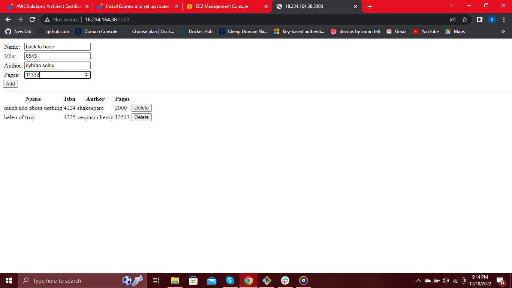

## __MEAN STACK IMPLEMENTATION (PROJECT-4)__ ##

__MEAN stack__ is a combination of the following:
* MongoDB (Document database) – Stores and allows to retrieve data.
* Express (Back-end application framework) – Makes requests to Database for Reads and Writes.
* Angular (Front-end application framework) – Handles Client ana server Requests.
* Node.js (JavaScript runtime environment) – Accepts requests and displays results to end user.

In order to complete this project you will need an AWS account and a virtual server with Ubuntu Server OS.

We are setting up a MEAN STACK using EC2 as our virtual server.
To do this we need to do the following:

* create an account on [AWS](https://aws.amazon.com/). 
* we create an instance (virtual machine) by selecting __“ubuntu server 20.04 LTS”__ from Amazon Machine Image(AMI)(free tier). 
* we select “t2.micro(free tier eligible)” 
* then go to the security group and select “existing security group” review and launch.

 How to create an aws free tier account. click [here](https://www.youtube.com/watch?v=xxKuB9kJoYM&list=PLtPuNR8I4TvkwU7Zu0l0G_uwtSUXLckvh&index=7)

This launches us into the instance as shown in the screenshot:


We open our terminal and go to the location of the previously downloaded __PEM file__.

To know how to download PEM File from __AWS__. Click [HERE](https://intellipaat.com/community/52119/how-to-download-a-pem-file-from-aws).

We connect to the instance from our ubuntu terminal using the command:

```$ ssh -i dybran-ec2.pem ubuntu@54.175.190.127```

This automatically connects to the instance


__TASK__

In this task, we are going to implement __a simple Book Register web form using MEAN stack__.

There are a few steps we need to take to accomplish this task. These steps include:

__INSTALLING NODEJS__

__Node.js__ is a JavaScript runtime built on Chrome’s V8 JavaScript engine. Node.js is used in this task to set up the __Express routes and AngularJS controllers__.

update ubuntu

```$ sudo apt update```


Next we upgrade ubuntu.

```$ sudo apt upgrade```


we add certificates by running these commands:

```$ sudo apt -y install curl dirmngr apt-transport-https lsb-release ca-certificates```

then

```$ curl -sL https://deb.nodesource.com/setup_12.x | sudo -E bash -```


Then we install node.js

```$ sudo apt install -y nodejs```


Then next step is to install __MongoDB__.

__INSTALLING MONGODB__

__MongoDB__ stores data in flexible, JSON-like documents. Fields in a database can vary from document to document and data structure can be changed over time. For our example application, we are adding book records to MongoDB that contain book name, isbn number, author, and number of pages.

To start installation process, we run the commands:

```$  sudo apt-key adv --keyserver hkp://keyserver.ubuntu.com:80 --recv 0C49F3730359A14518585931BC711F9BA15703C6```

 then

 ```$ echo "deb [ arch=amd64 ] https://repo.mongodb.org/apt/ubuntu trusty/mongodb-org/3.4 multiverse" | sudo tee /etc/apt/sources.list.d/mongodb-org-3.4.list```

 

 We then go ahead to install __mongoDB__ by running the command:

 ```$ sudo apt install -y mongodb```

 

 Next, we start the _MongoDB__ server.

 ```$ sudo systemctl start mongodb```

 To verify that the server is up and running, we run the command:

 ```$ sudo systemctl status momgodb```

 

 We then install __Node package manager__ (npm).

 ```$ sudo apt install -y npm```

 

 
We then Install body-parser package-We need __‘body-parser’__ package to help us process __JSON files__ passed in requests to the server.

```$ sudo npm install body-parser```

We create a folder named __"Books"__ and __"cd"__ into the folder using this command:

```$ mkdir Books && cd Books```


We then run the command to initialisze __npm project__.

```$ npm init```


Add a file to it named __server.js__.

```$ touch server.js```

Open the file 

```$ vim server.js```

Then copy the following codes into the __server.js__ file.

```
var express = require('express');
var bodyParser = require('body-parser');
var app = express();
app.use(express.static(__dirname + '/public'));
app.use(bodyParser.json());
require('./apps/routes')(app);
app.set('port', 3300);
app.listen(app.get('port'), function() {
    console.log('Server up: http://localhost:' + app.get('port'));
});
```

Then save and quit __press ESC, then :wq and ENTER__.


The next thing to do is to install __Express__ and set up __Routes__ to the __server__.

__INSTALLING EXPRESS AND SETTING UP ROUTES TO THE SERVER__

__Express__ is a minimal and flexible __Node.js web application framework__ that provides features for web and mobile applications. We will use Express to pass book information to and from our __MongoDB database__.

We also will use __Mongoose package__ which provides a straight-forward, schema-based solution to model your application data. We will use Mongoose to establish a schema for the database to store data of our book register.

Install __Express__ and __Mongoose__.

```$ sudo npm install express mongoose```


In ‘Books’ folder, create a folder named apps

```$ mkdir apps && cd apps```


In __Books directory__, create a file named __routes.js__.

```$ touch routes.js```

Open the file

```$ vim routes.js```

Copy the following codes into the file

```
var Book = require('./models/book');
module.exports = function(app) {
  app.get('/book', function(req, res) {
    Book.find({}, function(err, result) {
      if ( err ) throw err;
      res.json(result);
    });
  }); 
  app.post('/book', function(req, res) {
    var book = new Book( {
      name:req.body.name,
      isbn:req.body.isbn,
      author:req.body.author,
      pages:req.body.pages
    });
    book.save(function(err, result) {
      if ( err ) throw err;
      res.json( {
        message:"Successfully added book",
        book:result
      });
    });
  });
  app.delete("/book/:isbn", function(req, res) {
    Book.findOneAndRemove(req.query, function(err, result) {
      if ( err ) throw err;
      res.json( {
        message: "Successfully deleted the book",
        book: result
      });
    });
  });
  var path = require('path');
  app.get('*', function(req, res) {
    res.sendfile(path.join(__dirname + '/public', 'index.html'));
  });
};
```


Then save and quit __press ESC, then :wq and ENTER__.

still in the __apps__ folder, create a folder named __models__ and __cd__ into the folder. 

```$ mkdir models && cd models```

Create a file named __book.js__

```$ touch book.js```

Open the file

```$ vim book.js```

Ten we copy and paste the following codes into the file.

```
var mongoose = require('mongoose');
var dbHost = 'mongodb://localhost:27017/test';
mongoose.connect(dbHost);
mongoose.connection;
mongoose.set('debug', true);
var bookSchema = mongoose.Schema( {
  name: String,
  isbn: {type: String, index: true},
  author: String,
  pages: Number
});
var Book = mongoose.model('Book', bookSchema);
module.exports = mongoose.model('Book', bookSchema);
```


Next step is to access the __routes__ with __AngularJS__.

__ACCESSING THE ROUTE WITH ANGULARJS__

__AngularJS__ provides a web framework for creating dynamic views in your web applications. In this task, we use AngularJS to connect our web page with Express and perform actions on our book register.

We first change directory back to __Books__

```$ cd../..```

We create a folder named __public__ and __cd__ into the folder.

```$ mkdir public && cd public```


Create a file named __scripts.js__

```$ touch scripts.js```

Open the file

```$ vim scripts.js```

Copy and paste the following into the file. This is the defined controller configuration.

```
var app = angular.module('myApp', []);
app.controller('myCtrl', function($scope, $http) {
  $http( {
    method: 'GET',
    url: '/book'
  }).then(function successCallback(response) {
    $scope.books = response.data;
  }, function errorCallback(response) {
    console.log('Error: ' + response);
  });
  $scope.del_book = function(book) {
    $http( {
      method: 'DELETE',
      url: '/book/:isbn',
      params: {'isbn': book.isbn}
    }).then(function successCallback(response) {
      console.log(response);
    }, function errorCallback(response) {
      console.log('Error: ' + response);
    });
  };
  $scope.add_book = function() {
    var body = '{ "name": "' + $scope.Name + 
    '", "isbn": "' + $scope.Isbn +
    '", "author": "' + $scope.Author + 
    '", "pages": "' + $scope.Pages + '" }';
    $http({
      method: 'POST',
      url: '/book',
      data: body
    }).then(function successCallback(response) {
      console.log(response);
    }, function errorCallback(response) {
      console.log('Error: ' + response);
    });
  };
});
```


In public folder, create a file named __index.html__

```$ touch index.html```

Open the file

```$ vim index.html```

Copy and paste the following codes into the file.

```
<!doctype html>
<html ng-app="myApp" ng-controller="myCtrl">
  <head>
    <script src="https://ajax.googleapis.com/ajax/libs/angularjs/1.6.4/angular.min.js"></script>
    <script src="script.js"></script>
  </head>
  <body>
    <div>
      <table>
        <tr>
          <td>Name:</td>
          <td><input type="text" ng-model="Name"></td>
        </tr>
        <tr>
          <td>Isbn:</td>
          <td><input type="text" ng-model="Isbn"></td>
        </tr>
        <tr>
          <td>Author:</td>
          <td><input type="text" ng-model="Author"></td>
        </tr>
        <tr>
          <td>Pages:</td>
          <td><input type="number" ng-model="Pages"></td>
        </tr>
      </table>
      <button ng-click="add_book()">Add</button>
    </div>
    <hr>
    <div>
      <table>
        <tr>
          <th>Name</th>
          <th>Isbn</th>
          <th>Author</th>
          <th>Pages</th>

        </tr>
        <tr ng-repeat="book in books">
          <td>{{book.name}}</td>
          <td>{{book.isbn}}</td>
          <td>{{book.author}}</td>
          <td>{{book.pages}}</td>

          <td><input type="button" value="Delete" data-ng-click="del_book(book)"></td>
        </tr>
      </table>
    </div>
  </body>
</html>
```


Change directory back to __Books__

```$ cd ..```

Start the server by running the command

```$ node server.js```


The server is now up and running, we can connect it via __port 3300__.

To be able to access it from the internet, we go to __edit inbound rules__ on our instance and open TCP __port 3300__ by clicking on __add rules__ in our EC2 Instance. We then click on __save__ when we are done.


We can now access the Web book register application through our browser using

```http://<IP-address>:3300```

__N/B:__ The __IP address__ can be gotten from the __AWS__ instance.



We have successfully created our __Web Book Register Application__. 


